# Guide Touristique de Khenifra

Un guide touristique complet et responsif pour la ville de Khenifra, au Maroc.  
## Vue d'ensemble

Ce projet a ete entierement developpe en utilisant uniquement HTML5 et CSS Vanilla. Il sert de portail numerique pour l'ecotourisme a Khenifra, integrant un design immersif, des elements interactifs et une interface utilisateur epuree.

## Fonctionnalites Principales

- Structure semantique pure HTML5
- CSS Vanilla avec un systeme de variables et un design corporate
- Mises en page modernes avec CSS Grid et Flexbox
- Design 100% responsif 
- Formulaires interactifs et tableaux de donnees stylises
- Code de production propre et epure

## Architecture du Projet

Le projet est structure autour de quatre pages HTML principales et d'une feuille de style CSS centralisee.

## Details Techniques

- **index.html** : La page d'accueil principale comprenant une banniere hero cinematique et une grille d'informations.
- **lieux.html** : Un tableau de bord stylise presentant les destinations touristiques, construit sur une structure de tableau HTML semantique.
- **reservation.html** : Un formulaire de reservation complet utilisant une mise en page CSS Grid avancee.
- **contact.html** : Une page de contact moderne divisant l'ecran (split-layout) avec integration d'une carte interactive.
- **style.css** : Le systeme de design central utilisant des variables CSS, un reset moderne et des classes orientees composants.

## Contraintes de Developpement

Ce projet respecte des contraintes strictes :
1. Aucun framework CSS externe (Bootstrap, Tailwind, etc.).
2. Utilisation stricte d'elements HTML5 semantiques.
3. Esthetique professionnelle axee sur l'utilisabilite et la clarte.
4. Design minimaliste et serieux.

## Auteur

Hmoute Oussama
